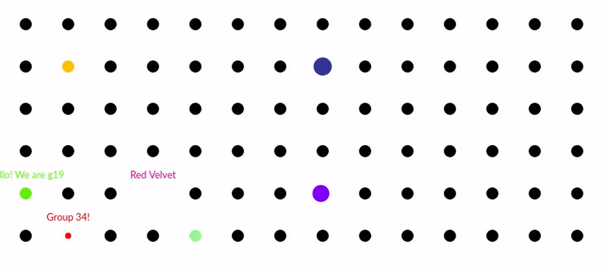

# Lab2: dotDevice
## EmSys Autumn 2021

__In this lab you will use your TinyPico to interact with a virtual embedded system.__ 
* Current Virtual Lab URL: [[http://ec2-52-15-138-171.us-east-2.compute.amazonaws.com:4000/](http://ec2-52-15-138-171.us-east-2.compute.amazonaws.com:4000/)]
* [[dotDevice Datasheet](https://github.com/STFleming/EmSys_dotDevice)]


Embedded systems are increasingly being used in situations where they are connected to a wider system via some sort of communications channel. In this lab, you will program your TinyPico to send commands to another device (which is virtual) via a WiFi connection. The device that you are sending commands to is called a dotDevice. This is a small dot that you can make move, change colour, change size, speak, and more. It even has some small programmable command memory to load a sequence of instructions in. Each group has a unique dot that they can interact with via their ``gid``, which should have been emailed to them when the groups were set up.  

The dotDevices have a strict protocol for receiving commands, I have created a datasheet for this virtual dotDevice, which can be found [[here](https://github.com/STFleming/EmSys_dotDevice)]. I have written to try and emulate a real datasheet to get you used to reading them. These are information rich documents, that can sometimes be difficult to parse, so take your time and maybe look at it a few times.  
## Viewing the virtual lab
All the dot devices live on a virtual lab server, to view this server please click the link marked ``Current virtual lab URL`` at the top of this page. __Please note that this URL might change from time to time if the server crashes (which might frequently happen)__.

## Sending commands to your dotDevice

In your GitHub Lab directory you should all have an example in ``lab2/example/example.ino``. 
```C
#include "dotDevice.h"

const char* ssid = "<YOUR WIFI SSID>";
const char* password = "<YOUR WIFI PASSWORD>";
const char* server ="ws://ec2-52-15-138-171.us-east-2.compute.amazonaws.com:1234";
const char* gid = "<YOUR GROUPS UNIQUE GID>";
String json_str;

dotDevice ddev(ssid, password, server);

void setup() {
	Serial.begin(115200);
	ddev.connect();
}

void loop() {
	delay(3000);
	json_str = "{ \"device\" : \""+String(gid)+"\", \"cmd\" : \"SAY\", \"text\": \"Woohoo!\" }";
    ddev.send(json_str);
}
```

To get the code above to work with your device please change the following:
* Change ``<YOUR WIFI SSID>`` to the name of your WiFi network.
* Change ``<YOUR WIFI PASSWORD>`` to the password of your WiFi network.
* Change ``<YOUR GROUPS UNIQUE GID>`` to the GID of your group that was emailed to you when you found out your group number.
* You may also have to change the server ``ec2-52-15-138-171.us-east-2.compute.amazonaws.com`` to match the current virtual lab URL if the server crashes. (The port number shouldn't be changed though) 

Once that is working you should see your dotDevice on the virtual lab URL say "Woohoo!".

## Task for this lab

There are three tasks for this lab. 
1. Create a sketch in your GitHub logbook repository, ``lab2/task1/task1.ino``, that sends commands to your virtual dotDevice to make it: speak, dance, change colour, and change size.
2. Create a sketch in your GitHub logbook repository, ``lab2/task2/task2.ino``, that uses the dotDevices command memory to perform a similar sequence to what you programmed in task1. 
3. Comment in the Lab2 README on the tradeoffs of using the dotDevices command memory against sending individual commands from the TinyPico.

